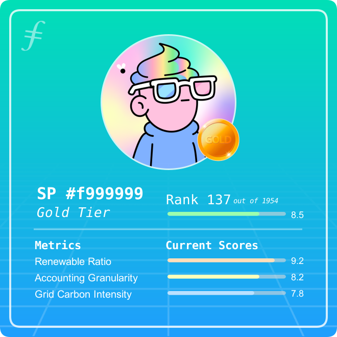
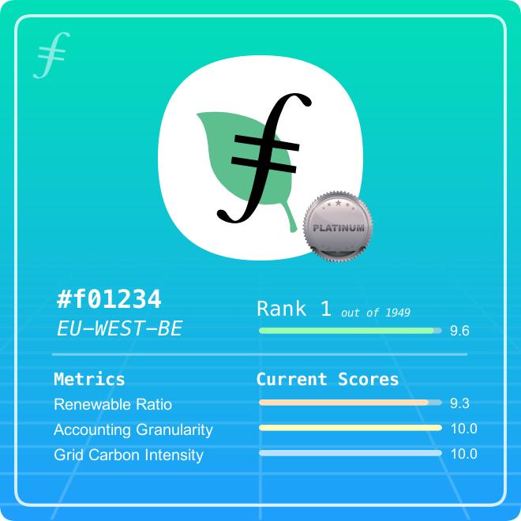

# EcoSoul-bound Community NFT

This ERC721 implementation is a non-transferrable token that represents the green reputation metrics of a Filecoin Storage Provider. All metrics are hosted as metadata on IPFS via Pinata and set via a token base URI on the contract.

Check out the deployed NFT contract on Rinkeby Testnet: [0xEf3Ccc57Cd2c161658dF80A6C4BED5Ec0F98f95a](https://rinkeby.etherscan.io/address/0xEf3Ccc57Cd2c161658dF80A6C4BED5Ec0F98f95a)

Check out the NFT Metadata hosted on IPFS via Pinata [here](https://gateway.pinata.cloud/ipfs/QmcLdUq1LKKtW39a4KUKWepfF9SZnvADqqxUmGCUCseC5P).

Here's an example of a EcoSoul NFT Image:



Here's an example of a EcoSoul NFT JSON Metadata:

```
{
  "name": "EcoSoul #f01234",
  "description": "EcoSoul: Community NFT for Filecoin Green's Certified Eco-friendly Storage Providers",
  "image_url": "https://gateway.pinata.cloud/ipfs/QmTku43xCiXTH85r3WDBMkVT6fUD8N8GgvaU8zHSLAbJtf/f01234.png",
  "tokenId": 1,
  "attributes": [
    {
      "trait_type": "Tier",
      "value": "Platinum"
    },
    {
      "trait_type": "Rank",
      "value": 1
    },
    {
      "trait_type": "Overall Green Score",
      "value": "9.56"
    },
    {
      "trait_type": "Renewable Energy Ratio Score",
      "value": "9.26"
    },
    {
      "trait_type": "Accounting Granularity Score",
      "value": "10.00"
    },
    {
      "trait_type": "Grid Carbon Intensity Score",
      "value": "10.00"
    }
  ]
}

```

### Tiers

All storage providers are given tiers based on their overall green reputation score and rank. The tiers are as follows:

- Platinum Tier: Top 50 Most Green SP's
- Gold Tier: Top 150 Most Green SP's
- Silver Tier: Top 300 Most Green SP's
- Certified Tier: if score > 7.5

These tiers are represented as badges on the community NFT image. Here's an example of a storage provider with a platinum badge:



Learn more about how these metrics were calculated [here](/score/) or learn about the project [here](/CONTEXT.md).
