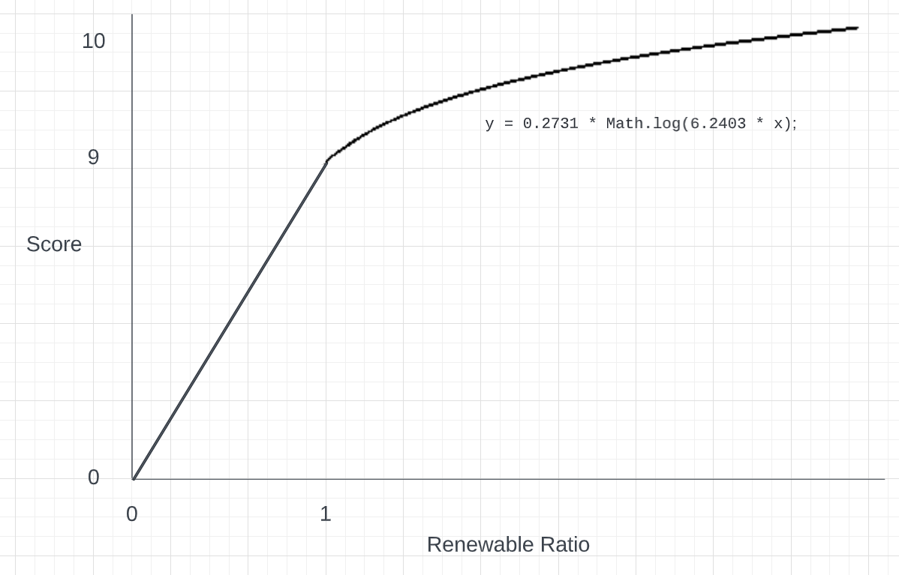

# Green Reputation Score

The Green Reputation Score is a score that measures how "green" a Filecoin Storage Provider. This score is at the core of the EcoSoul project. It comprises of three following sub-category scores:

1. Renewable Energy Ratio Score (i.e. _rScore_)
2. Accounting Granularity Score (i.e. _aScore_)
3. Grid Carbon Intensity Score (i.e. _iScore_)

We take the weighted sum of the three scores in the following manner:

$Green Score = 0.6 \cdot rScore + 0.2 \cdot aScore + 0.2 \cdot iScore$

Read more to learn about how each category score was calculated.

## 1. Renewable Energy Ratio Score

### Question

_“In the history of your operation, what percentage of the electricity you spent came from renewable energy sources?”_

### Calculation

`Ratio = Total renewable energy from purchased RECs / Total energy consumption`

Final Weighted Score Value (between 0 and 10):

```
if (0 <= ratio <= 1) {                    // when ratio is less than or equal to 1
    score = ratio * 9;
}
else {                                    // when ratio larger than 1 (negative emissions)
    const surplusRatio = ratio - 1;
    const weightedSurplus = 0.2731 * Math.log(6.2403 * surplusRatio);
    if (weightedSurplus > 10) score = 10
    else { score = weightedSurplus }
}
```

The goal of this weighting was to minimize the effects of storage providers who had a very small cumulative energy value in comparison to their total renewable energy from purchased RECs, that skewed the dataset heavily in favor of them (e.g. renewable energy ratio > 100). The above weighting can be plotted as follows:



### Relevant APIs:

1.  Filecoin Green Renewable Energy Certificates API: [/transactions](https://proofs-api.zerolabs.green/swagger/#/Filecoin%20nodes/FilecoinNodesController_getTransactions)
2.  Filecoin Green Renewable Energy Certificates API: [/contracts](https://proofs-api.zerolabs.green/swagger/#/Filecoin%20nodes/FilecoinNodesController_findOneWithContracts)
3.  Filecoin Green Renewable Energy Consumption API: [CumulativeEnergyModal_v_1_0_1](https://api.filecoin.energy/docs/#/default/modelsExport)

Learn more about the Filecoin Green API [here](https://filecoin-green.gitbook.io/filecoin-green-documentation/).

## 2. Accounting Granularity Score

### Question

_“How closely does the renewable energy you’ve purchased match the energy you’ve consumed?”_

### Calculation

In a given miner’s history of operation, calculate the accounting period for every REC they’ve purchased (where each Accounting Period (or `AC`) is reporting end time minus reporting start time).

$AP = [AP_1, AP_2 …, AP_n]$

Weight each of the accounting periods (measured in days) by how long they are, where the weight is higher for shorter accounting periods (thus rewarding more granular accounting periods).

$w_i = [w_1, w_2, …, w_n] = [f(AP_1), f(AP_2) …, f(AP_n)]$

We explore the following exponential formula for the weight calculation:

$w_i = f(AP_i) = 0.6966 * e^{(-0.0023 AP_i)}$

| Period (days) | Weight |
| ------------- | ------ |
| 365           | 0.3    |
| 180           | 0.46   |
| 90            | 0.57   |
| 30            | 0.65   |

Finally, we calculate the weighted sum of the accounting periods, and normalize to a score between 0 and 10.

$aScore =\sum_{i=1}^{n} w_i * AP_i$

### Relevant Context

[GHG Protocol Scope 2 Guidance](https://ghgprotocol.org/scope_2_guidance) says the ideal scenario is "...[RECs] are issued and redeemed as close as possible to the period and location of electricity consumption". Rewarding Storage Providers with shorter accounting periods is beneficial for this reason. In order words, _we'd rather see Storage Providers snack on RECs rather than binge RECs in one-sitting._

### Relevant APIs:

1.  Filecoin Green Renewable Energy Certificates API: [/contracts](https://proofs-api.zerolabs.green/swagger/#/Filecoin%20nodes/FilecoinNodesController_findOneWithContracts)
2.  Filecoin Green Renewable Energy Consumption API: [CapacityModel](https://api.filecoin.energy/docs/#/default/modelsExport)

## 3. Grid Carbon Intensity Score

### Question

“What is the marginal emissions rate at which your power grid operates (CO2 lb/MWh)?”

### Calculation

Normalize MOER values given from WattTime API using the estimated location from JimPick's API for each Filecoin Storage Provider.

### Relevant APIs:

1. WattTime API for Marginal Operation Emissions Rate: [/index](https://api2.watttime.org/v2/index)
2. Jim Pick's Synthetic Locations API: [synthetic-locations-latest.json](https://provider-quest.s3.us-west-2.amazonaws.com/dist/geoip-lookups/synthetic-locations-latest.json)
